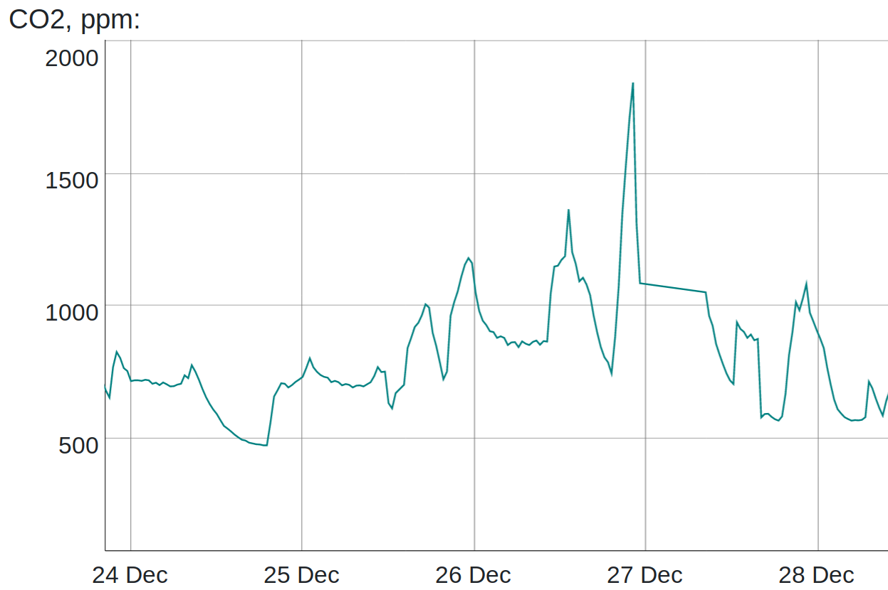

This tutorial explains how to connect Gravity UART MH-Z16 CO<sub>2</sub> sensor from DFRobot to Raspberry Pi
and get CO<sub>2</sub> readings.
This is a nice NDIR-sensor with a wide range, up to 50000 ppm.

<!--more-->

I have used Raspberry Pi 3 B+ for the tutorial below, but it can be applied for other models as well.

### Restore UART0

There are two UARTs on Raspberry Pis: UART0 (PL011) and miniUART. miniUART is not suitable for this sensor. It could be used,
but baud rate and communications would not be stable.

UART0 is connected to GPIO 14 and 15. The interface level is 3.3V which corresponds to interface level of MH-Z16 CO<sub>2</sub> sensor.

Raspberry Pi uses UART0 for Bluetooth module by default. Adding `dtoverlay=pi3-disable-bt` to `/boot/config.txt` disables
 the Bluetooth device and restores UART0 to GPIO 14 and 15 (`ttyAMA0`).  Apparently the modem has to be disabled as well:
`sudo systemctl disable hciuart`.

Note that you might need to update your Raspberry Pi if the kernel does not support device overlay (`dtoverlay`):

```
$ sudo apt-get update && sudo apt-get upgrade
```

If commands above did not bring required firmware, you can get the very latest firmware running `sudo rpi-update`.

See [The Raspberry Pi UARTs](https://www.raspberrypi.org/documentation/configuration/uart.md) for more information.

### Testing UART0

After reboot, connect GPIO 14 and 15 pins together.
Install `minicom` to test serial communications:

```
sudo apt-get install minicom
```

Run `minicom -D /dev/ttyAMA0` and start typing to verify whether serial communictions work on UART0.

### Connecting Gravity UART CO<sub>2</sub> sensor

Gravity UART has 4 pins: `5V`, `GND`, `TX`, `RX`. Note that interface level of `TX/RX` is `3.3V`, but power is `5V`.

Connections:

| Raspberry Pi 3 B+ pin | Gravity UART pin |
|-----------------------|------------------|
|  5V                   |  5V              |
|  GND                  |  GND             |
|  GPIO 14 pin          |  TX              |
|  GPIO 15 pin          |  RX              |


### Getting CO<sub>2</sub> measurements

Communication protocol is described in
[Datasheet MH-Z16](https://github.com/Arduinolibrary/DFRobot_Gravity_UART_Infrared_CO2_Sensor/raw/master/MH-Z16%20CO2%20Datasheet.pdf).

I have used `python3` script to get CO<sub>2</sub> measurements from Gravity UART MH-Z16 sensor.
`python-serial` is required as a dependency.

```
#!/usr/bin/python3

import serial
import binascii
import sys

def verify_checksum(bytes):
  if len(bytes) != 9:
    return False
  sum = 0
  for i in range(1, 8):
    sum += bytes[i]
  sum = sum % 256
  checksum = 255 - sum + 1

  return bytes[8] == checksum

def get_co2(con):
  con.write(bytearray(b'\xff\x01\x86\x00\x00\x00\x00\x00\x79'))
  rcv = con.read(9)
  if not verify_checksum(rcv):
    print("Checksum error from received: `{}'".format(binascii.hexlify(rcv)), file=sys.stderr)
    return -1
  return rcv[2] * 256 + rcv[3]

def calibrate_span(con):
  con.write(bytearray(b'\xff\x01\x88\x07\xd0\x00\x00\x00\xa0'))

def calibrate_zero(con):
  con.write(bytearray(b'\xff\x01\x87\x00\x00\x00\x00\x00\x78'))

con = serial.Serial("/dev/ttyAMA0", 9600, timeout=5)
co2 = get_co2(con)
con.close()

if co2 < 100 or co2 > 6000:
  print("CO2 concentration {} is out of range".format(co2), file=sys.stderr)
  exit(1)

print(co2)
```

You can get very nice historical CO<sub>2</sub> measurements inside or outside:


