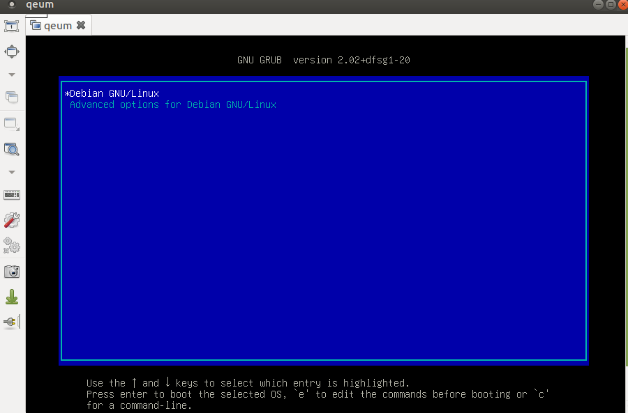

Not all hosting providers offer a free remote console. It makes it difficult to debug certain issues with grub,
especially when LUKS and/or LVM is used. Rescue mode, on the other hand, is offered. That
removes the need for a remote console in most of the cases.

<!--more-->

Reboot your machine in the rescue mode. Check devices with `lsblk`:

``` shell
sda                   8:0    0 232.9G  0 disk
├─sda1                8:1    0     1G  0 part
└─sda2                8:2    0 231.9G  0 part
```

In my case, `/dev/sda1/` contains un-encrypted boot partition (it is 1GB for historical reasons) and `/dev/sda2/` is LUKS-encrypted LVM root partition.

I had issues with the booting and could not use the remote console. QEMU helped me to diagnose the issue from rescue:

```shell
qemu-system-x86_64 -snapshot -vnc 0.0.0.0:0 -m 5G -enable-kvm -hda /dev/sda
```

- `-snapshot`, with this option changes won't be written to `/dev/sda`. This option is useful if `/dev/sda` is mounted together with `qemu` running.

- `-vnc 0.0.0.0:0` will open port `5900` for remote VNC.

- `-m 5G`, default memory (128 MB) might be too low.

With this running you can use `Remmina` with VNC protocol to connect to the machine and debug boot-issues:


