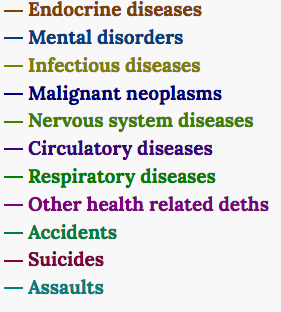

Have you ever wondered what is probably going to kill you if you die at certiange age?
Based on data from Statistics Netherlands (or Centraal Bureau voor de Statistiek)
we could try to figure out main cause of death for different age groups.

<!--more-->

I've just collected the most recent data from [Statistics Netherlands (CBS)](https://www.cbs.nl)
on main cause of death at the certain age. The data is based on 2016. The following death causes are taking into account:

Age of interest is on x-axis, y-axis is split into different causes of death which should sum up to 100%.
Hover mouse over an area of interest to get actual numbers for this cause of death and age:

