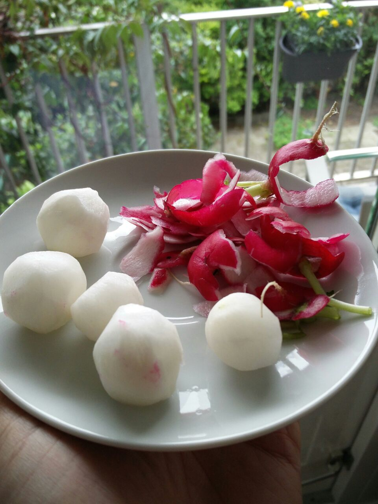
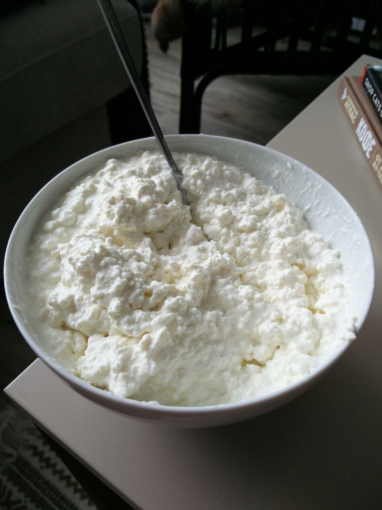
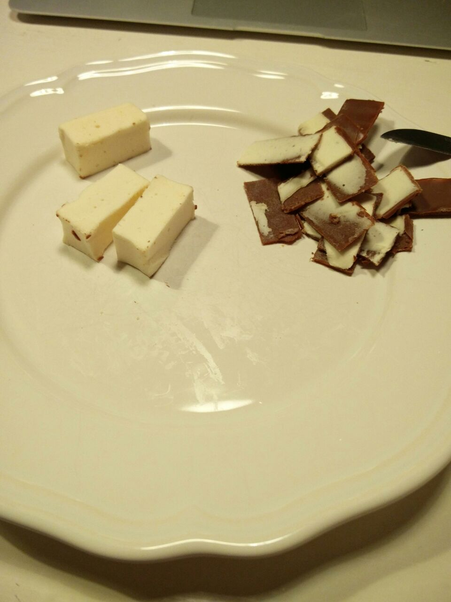
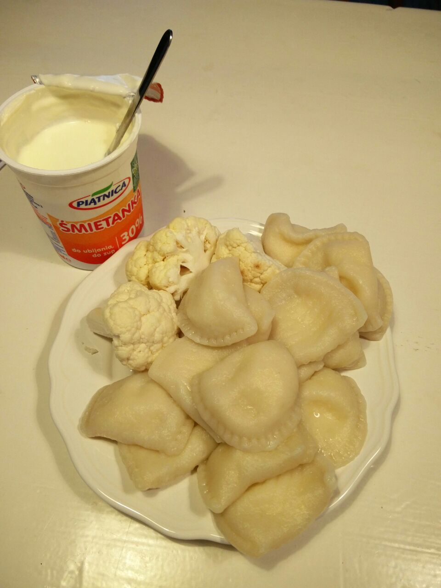
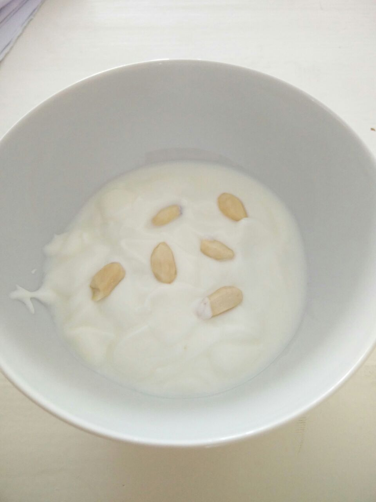

 Посвящено Сати

Свою жизнь Сати описывал так:
"Жизнь артиста (в широком смысле этого слова) должна быть упорядоченной.

Мои ежедневные действия: Просыпаюсь в 7:18. Вдохновляюсь с 10:23 до 11:47. Обедаю в 12:11 и выхожу из-за стола в 12:14. Живительная прогулка верхом с 13:19 до 14:53. Следующий приступ вдохновения с 15:12 до 16:07. С 17 до 18:47 все остальное (фехтование, созерцание, неподвижность, посещения, разработка рук, плавание,...). Ужин накрывают в 19:16 и кончают в 19:20. С 20:09 до 21:59 симфоническое чтение (вслух). Ложусь регулярно в 20:37. Раз в неделю (по вторникам) внезапно просыпаюсь в 3:14.

Мой рацион состоит целиком из белой пищи: яйца, сахар, тертые кости, жир мертвых животных, телятина, соль, кокос, курица, приготовленная в белой воде, заплесневелые фрукты, рис, репа, колбаса в камфоре, выпечка, сыр белый, салат из ваты и рыба без шкуры. Я кипячу вино и пью его холодным смешивая с соком фуксии. У меня хороший аппетит, но я никогда не разговариваю во время еды из-за страха подавиться.

Я дышу аккуратно (по-немногу за каждый раз) и танцую очень редко. Во время ходьбы держусь за ребра и пристально смотрю назад.

Мое выражение очень серьезно; когда я смеюсь, то делаю это непреднамеренно, и всегда потом извиняюсь.

Сплю только с одним закрытым глазом, очень крепко. Моя кровать круглая с дыркой для головы. Каждый час слуга заменяет мою температуру на другую."

Всем срочно на диету Сати. Поддержим гения, который умудрился иметь 2 рояля в 9 квадратных метрах.

Одной недели точно хватит...
